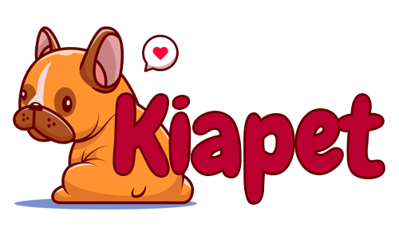

  

# 🐾 Kiapet - O melhor para o seu melhor amigo!

Este é um projeto desenvolvido utilizando HTML, CSS, Bootstrap e um pouco JavaScript para o Instituto Nu + Descomplica.
Onde devíamos criar uma loja virtual.

Eu escolhi criar um Petshop online, no qual a idéia é que a maior parte dos lucros seja revertida para uma ONG de proteção aos animais,
e além da loja temos também a área onde poderá ver alguns pets disponíveis para adoção, a equipe e um pouco mais sobre a empresa.

A responsividade foi implementada com media queries e bootstrap.
Em breve será adicionado a funcionalidade de adicionar ao carrinho, projeto ainda em desenvolvimento.

Poderá visualizar o site acessando o link a seguir:
https://gaberelaa.github.io/Kiapet/

## Tecnologias utilizadas:
O projeto foi desenvolvido utilizando as seguintes tecnologias:

- HTML
- CSS
- Bootstrap
- JavaScript

## Contato

Se você tiver alguma dúvida ou sugestão de melhoria para o projeto, não hesite em entrar em contato comigo através do meu email: zuninogabi@icloud.com.
